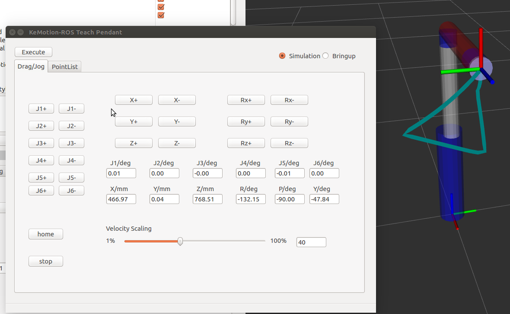
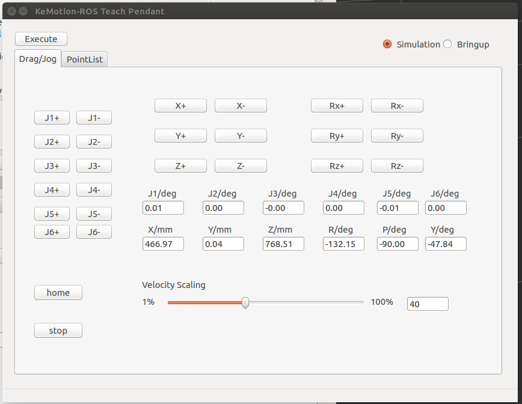
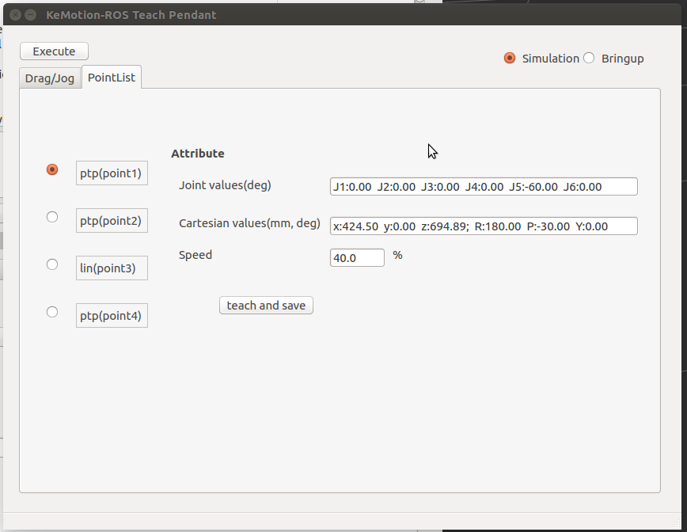

KeMotion-ROS Teach Pendant
======

## Features

1.	This demo has two modes: `simulation` and `bring up`
2.	Simulation through fake controller instead of gazebo
3.	bring up mode is based on [rmi_driver](https://github.com/smith-doug/rmi_driver). This package uses interfaces [robot_movement_interface](https://github.com/ros-industrial/robot_movement_interface) 
4.	moveit interface adopted in simulation mode is little different from actual keba robot controller in ptp/lin, which is only for reference



5.  video demo see [demo](docs/videos/demo.mp4)

## Preparation:ROS

- Version：

| item| version |
| :------ | :------ |
|ubuntu|16.04|
|ros|kinetic|
|[rmi_driver](https://github.com/smith-doug/rmi_driver)|DigitalIO or newer branch|
|[robot_movement_interface](https://github.com/ros-industrial/robot_movement_interface)|-|


Install or upgrade **MoveIt!**:

```sh
sudo apt-get update
sudo apt-get install ros-kinetic-moveit*
```

Install dependency **TrackIK**:

```sh
sudo apt-get install ros-kinetic-trac-ik-kinematics-plugin
```


- Install this package **RTP Demo**:

```sh
cd ~/catkin_ws/src
git clone https://github.com/wumin199/KeMotion-ROS-Teach-Pendant.git
cd ..
catkin_make
source devel/setup.bash
```

## Preparation:Keba Controller

- Version：

| item| version |
| :------ | :------ |
|controller version|V3.16 or newer|
|ROS lib|0.0.10|

KAIRO program and controller project, see `ER7_RPT.project`(Contact keba engineer to provide it)

In this project, you can modify `CP088/C Motion`, `T70R` into others


## Setup

- ROS

1. run rviz: `roslaunch er7_moveit_config demo.launch`
2. run demo gui: `roslaunch rtp_gui demo.launch`

If you want to switch to bring up mode, you need to :


- <span id="controllerSetup">Controller(bring up mode)</span>

1. Make sure PC and controller in the same network. For example, controller adopts `192.168.101.100`，PC adopts`192.168.101.101`
2. Download the controller project into controller
3. Make sure teach pendant in external mode, press `F1` to load and start the program.(`F2` to stop and uninstall the program)


## Usage

`Drag/Drog`Mask:



| UI Element| notes |
| :------ | :------ |
|Simulation and Bringup|Select `Simulation` to use simulation mode, and `Bringup` for actual connection to keba controller|
|Execute|Perform a continuous movement in simulation or bringup mode, the points of which are in the `PointList` Tab |
|J1+~J6-|Axis jogging, only valid in simulation mode|
|X+～Rz-|Cartesian jogging,only valid in simulation mode|
|Home|Robot homing, only valid in simulation mode|
|Stop|Robot stoping, only valid in simulation mode|
|Velocity Scaling|Velocity setting, only valid in simulation mode|
|J1/deg~J6/deg|Display current joint values|
|X/mm~Y/deg|Dispaly current cartesian values, using RPY notation|

`PointList`Mask:



| UI Element| notes |
| :------ | :------ |
|ptp(point1)~ptp(point4)|Continuous motion from point1 to point4 will execute when pressing `Execute`. Each point has a default value and can be modified by pressing `teach and save` |
|Attribute column|Display coordinates and velocity under current point|
|teach and save|Record current values to pont1 ~ point4|


- Simulation

You can jog the model and press `teach and save` to keep current values to point1 ~ point4. Continuous movement can be realized by pressing `teach and save`. velocity can be changed by `Velocity Scaling`.


- Bring up

Before using this mode, you should set up controller[controller setup](#controllerSetup), and make sure teach pendant program is in running state.

Press `Execute` under `Bringup`, it will send point1 ~ point4 to keba controller for execution. At this time, robot model is updated by controller feedback.

Default blending `ovlrel = 80` is set for each point.

Jogging is invalid under this mode.

- Bugs

1. MoveGroupInterface interface can cause move group crash. This issue may happen when jogging. see[Apparent race condition causes trajectory_execution_manager to crash](https://github.com/ros-planning/moveit/issues/1481)


## rmi_driver

bring up mode is based on [rmi_driver](https://github.com/smith-doug/rmi_driver)

topic is used to communicate with *rmi_driver*:

topic: `command_list`

data type: `robot_movement_interface::CommandList`

That is, as long as users convert the point information they want to execute into `robot_movement_interface::CommandList` and publish it to the topic `command_list`, `rmi_driver` will receive and relay it to the real robot controller.
